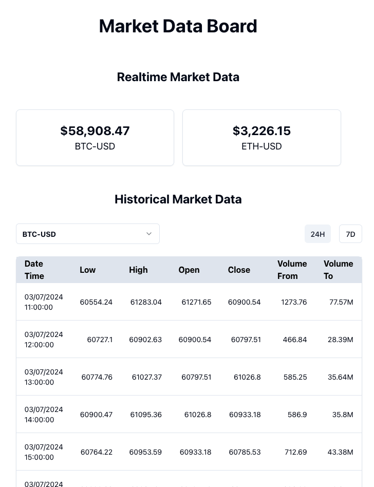
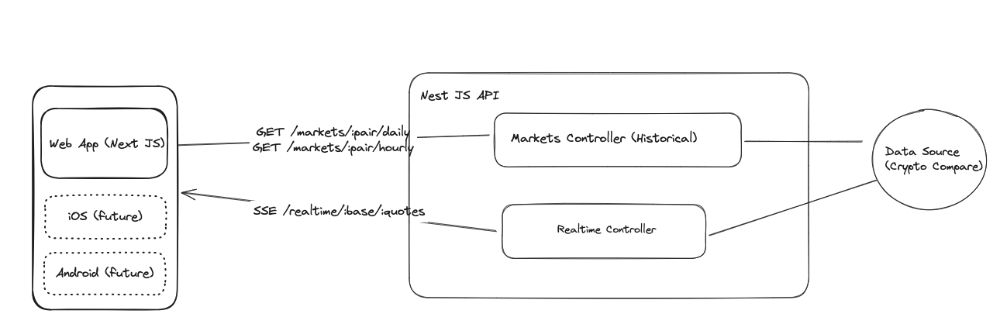

# Project Brief

You are given the task of writing a simple and state-of-the-art web application which exposes the real time market data in USD for the two cryptocurrencies BTC and ETH for potential investors.

Investors additionally want to see how the market price of a currency has developed historically over the last 24 hours, and 1 week.



## Functional Requirements

- A user should be able to get the current market price of BTC and ETH in USD in real time
- A user should be able to get the historical market price of BTC and ETH in USD, daily over the past 7 days
- A user should be able to get the historical market price of BTC and ETH in USD, hourly over the past 24 hours

## Non-Functional Requirements

- The system should be able to swap out the market data sources for other providers with minimal disruption to the existing API
- The system should be able to leverage other clients such as mobile applications
- The system should efficiently leverage the data source so as not to exhaust the number of queries allowed by the data provider under the API key (Crypto Compare)
- The system should be highly testable and able to be deployed in production

## Tooling

I wanted to try combining Next JS and Nest JS. I am familiar with Next JS, but never used Nest JS before this task. I found it intuitive to use, but clearly there is lots of room for improvement (e.g. tests, using the CLI to create the files etc).

## High Level System Architecture



### Historical Data

Historical data was gathered via the API endpoints of CryptoCompare which served as a datasource, and then made available by way of a REST API built using Nest JS.

### Realtime Data

There were two options I considered for implementation, and both were explored.

Option 1, was to use the WebSocket API provided by the CryptoCompare API and push these updates to the client via Server Sent Events or Websockets.

Pros:

- Updates from the data source are pushed from Crypto Compare to my API server, which are in turn pushed to connected clients

Cons:

- To get the realtime updates for multiple pairs, means setting up a websocket client and server for each currency pair. This can become resource intensive as more pairs are added.
- The API key being used for this project only allowed one connection at a time as shown below

```json
{
  "TYPE": 429,
  "MESSAGE": "TOO_MANY_SOCKETS_MAX_1_PER_CLIENT",
  "INFO": "You have reached your maximum sockets open for your subscription"
}
```

Option 2, was to use an API endpoint to get the current prices for each pair and push these updates to the client via Server Sent Events.

Pros:

- One API call can be used to get multiple base and quote pairs simultaneously. The results can then be pushed to connected clients.

Cons:

- Not truly a realtime update, as we are pulling the information vs having it pushed to the system server. The trick then becomes establishing a **reasonable** cadence to get the updates from the data source. For this exercise I used a 5 second interval.
- If there is no new data available on Crypto Compare, an API call is still made to get the current prices.

I assumed here that there is some allowance for the _realtime_ updates and as such I chose option 2. Other assumptions included:

- For this exercise, all users will have the same realtime data requests (e.g. BTC/USD, ETH/USD)
- Adding or removing a currency pair to the UI should be quick and relatively simple, without much disruption to the API.

It will be noted that there are no automated tests. This was done so as to allow for focus on the functional requirements.

## How to Run

### Nest JS API

In your terminal run go to the root of the markets-api project and run:

```console
$> npm install
$> nest start
```

This project runs on port 3001.

### Next JS Frontend

In your terminal run go to the root of the markets-frontend project and run:

```console
$> npm install
$> npm run dev
```
